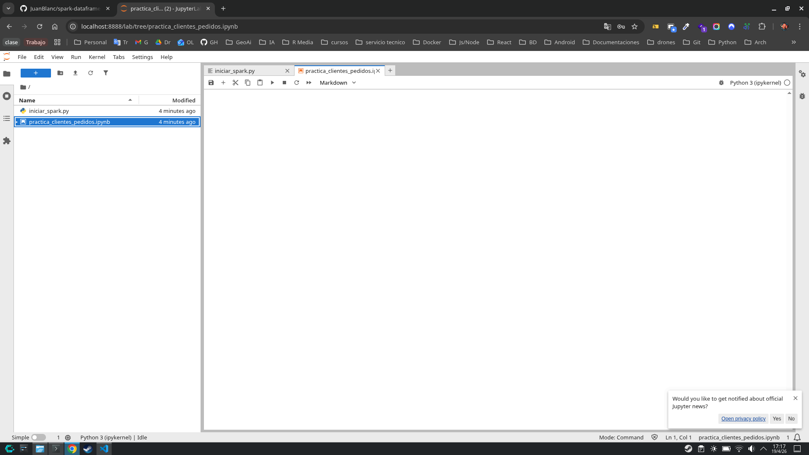
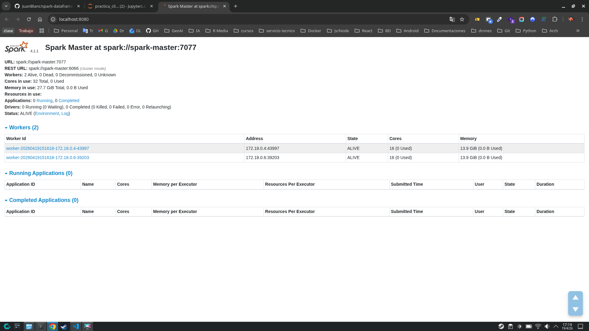
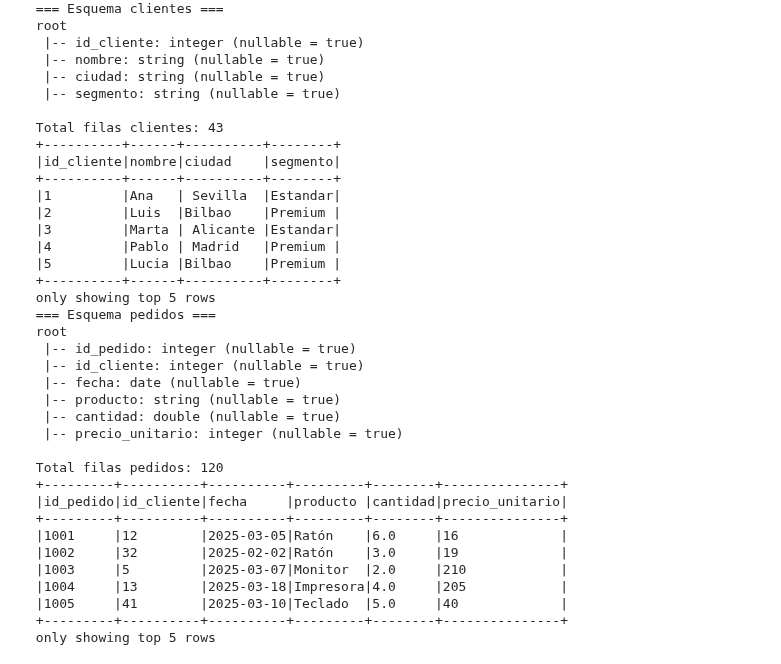
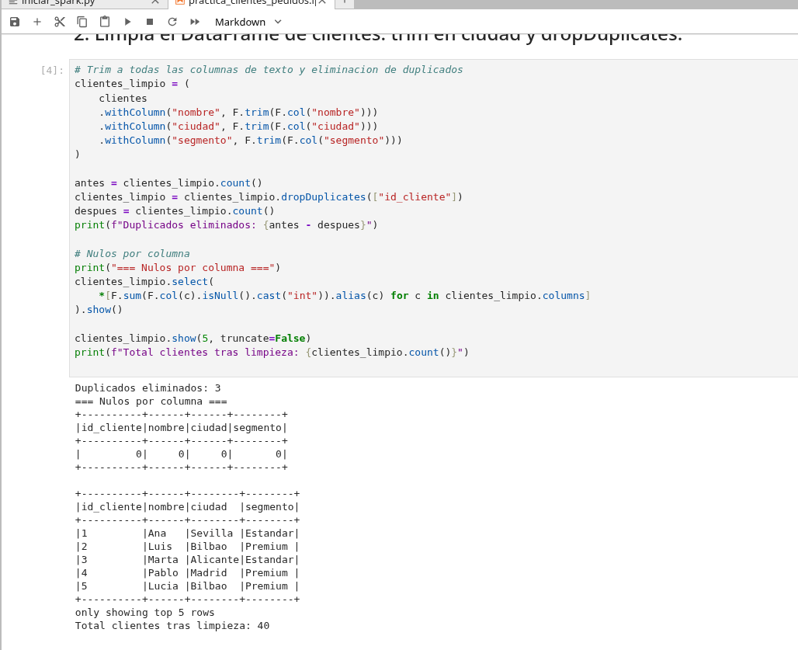
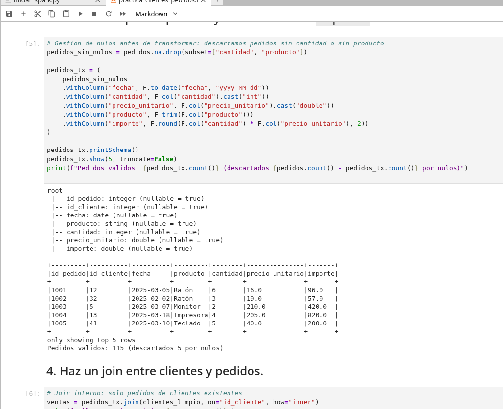
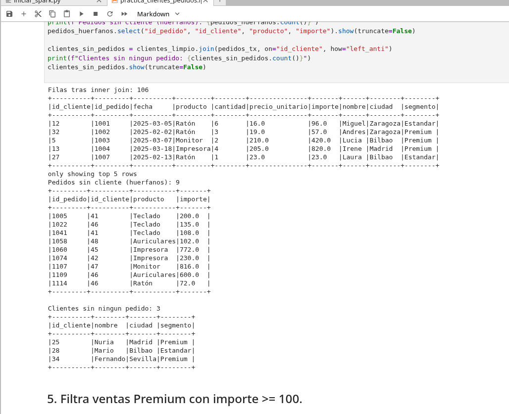
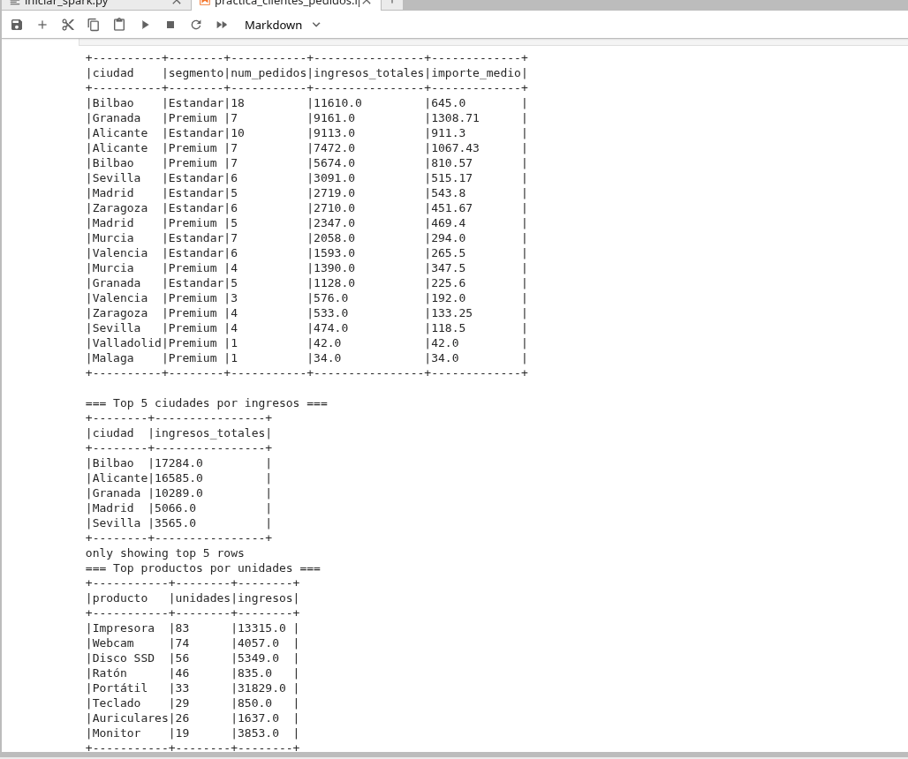
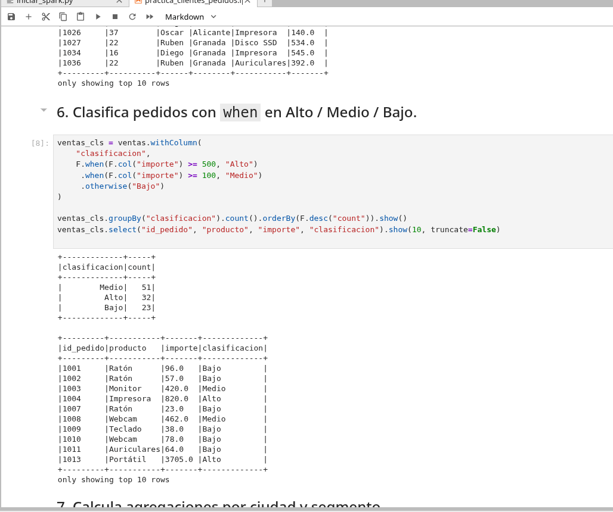
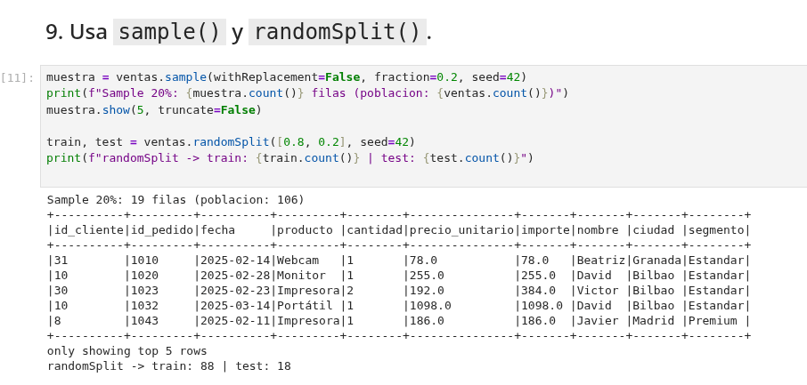
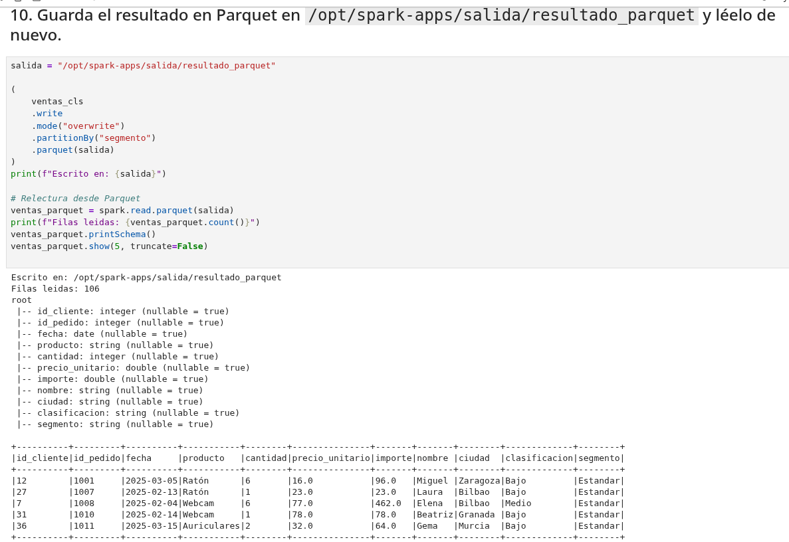

# Evidencias de la práctica

Se documentan a continuación las salidas y observaciones más relevantes obtenidas al ejecutar el notebook `spark_jupyter/notebooks/practica_clientes_pedidos.ipynb`.

## 1. Entorno levantado

- **JupyterLab**: [http://localhost:8888](http://localhost:8888) (token `spark`)
- **Spark Master UI**: [http://localhost:8080](http://localhost:8080)
- **Spark Worker 1**: [http://localhost:8081](http://localhost:8081)
- **Spark Worker 2**: [http://localhost:8082](http://localhost:8082)
- **Spark History Server**: [http://localhost:18080](http://localhost:18080)
- **Spark Application UI** (mientras se ejecuta el notebook): [http://localhost:4040](http://localhost:4040)



*Captura 1 · JupyterLab accesible en el puerto 8888.*


*Captura 2 · Spark Master UI mostrando los dos workers y la aplicación en ejecución.*

## 2. Lectura de datos

- `clientes.csv`: **43 filas**, 4 columnas (`id_cliente`, `nombre`, `ciudad`, `segmento`).
- `pedidos.csv`: **120 filas**, 6 columnas (`id_pedido`, `id_cliente`, `fecha`, `producto`, `cantidad`, `precio_unitario`).
- Separador `;` y primera fila como cabecera.
- `inferSchema=True` resuelve los tipos correctamente (la `fecha` se convierte a `date` explícitamente con `to_date`).
- Versión de Spark: **4.1.1**.


*Captura 3 · Salida de `printSchema()` y `show()` para ambos DataFrames.*

## 3. Limpieza

- **Duplicados en clientes**: **3 filas** duplicadas (ids 16, 17 y 20). Tras `dropDuplicates(["id_cliente"])` quedan **40 clientes únicos**.
- **Trim** aplicado a `nombre`, `ciudad` y `segmento` (p.ej. `" Sevilla "` → `"Sevilla"`).
- **Nulos en clientes**: 0 en todas las columnas tras la limpieza.
- **Nulos en pedidos**: **5 pedidos descartados** por tener `cantidad` o `producto` nulos (ids 1006, 1012, 1028, 1057 y 1084) → quedan **115 pedidos válidos**.
- Tipos tras el `cast`: `cantidad` a `int`, `precio_unitario` a `double`, `importe = cantidad * precio_unitario` (round 2).


*Captura 4 · Conteo de duplicados eliminados, tabla de nulos y muestra de clientes ya limpios.*


*Captura 5 · Esquema tipado y nueva columna `importe`.*

## 4. Join

- **Inner join** entre `pedidos_tx` y `clientes_limpio` por `id_cliente` → **106 filas**.
- **Pedidos huérfanos** (perdidos en el inner join): **9 filas** cuyo `id_cliente` ∈ {41, 42, 45, 46, 47, 48} no existe en `clientes` (algunos ids aparecen repetidos):
  - 1005 (41), 1022 (46), 1041 (41), 1058 (48), 1060 (45), 1074 (42), 1107 (47), 1109 (46), 1114 (46).
- **Clientes sin ningún pedido** (`left_anti` desde `clientes_limpio`): **3** → Nuria (Madrid, Premium), Mario (Bilbao, Estandar), Fernando (Sevilla, Premium).
- Interpretación: el inner join prioriza la consistencia referencial. Un `left join` permitiría conservar los 115 pedidos (con columnas de cliente a `null` para los huérfanos) si interesase auditarlos.


*Captura 6 · Resultado del inner join, tabla de pedidos huérfanos (`left_anti`) y clientes sin pedidos.*

## 5. Agregaciones

### Ingresos por ciudad y segmento (top)

| ciudad | segmento | num_pedidos | ingresos_totales | importe_medio |
|---|---|---|---|---|
| Bilbao | Estandar | 18 | 11 610,0 | 645,00 |
| Granada | Premium | 7 | 9 161,0 | 1 308,71 |
| Alicante | Estandar | 10 | 9 113,0 | 911,30 |
| Alicante | Premium | 7 | 7 472,0 | 1 067,43 |
| Bilbao | Premium | 7 | 5 674,0 | 810,57 |

### Top 5 ciudades por ingresos

Bilbao 17 284 · Alicante 16 585 · Granada 10 289 · Madrid 5 066 · Sevilla 3 565.

### Top productos por unidades / ingresos

Impresora (83 ud, 13 315 €) · Webcam (74 ud) · Disco SSD (56 ud).
El **Portátil** lidera ingresos absolutos con **31 829 €** pese a solo 33 unidades.

### Clasificación con `when`

- Alto (≥ 500 €): **32**
- Medio (≥ 100 €): **51**
- Bajo (< 100 €): **23**

### Filtro Premium con `importe ≥ 100`

**34 ventas** cumplen la condición.


*Captura 7 · Salida de `groupBy("ciudad","segmento")` con `num_pedidos`, `ingresos_totales` e `importe_medio`.*


*Captura 8 · Conteos por clasificación y muestra con la columna `clasificacion`.*

## 6. SQL

Vista temporal `ventas` + dos consultas.

```sql
SELECT segmento,
       COUNT(*)                 AS num_pedidos,
       ROUND(SUM(importe), 2)   AS ingresos_totales,
       ROUND(AVG(importe), 2)   AS ticket_medio
FROM ventas
GROUP BY segmento
ORDER BY ingresos_totales DESC;
```

Resultado:

| segmento | num_pedidos | ingresos_totales | ticket_medio |
|---|---|---|---|
| Estandar | 63 | 34 022,0 | 540,03 |
| Premium  | 43 | 27 703,0 | 644,26 |

Top 5 clientes por ingresos: Rubén (Granada) 7 112 · Óscar (Alicante) 6 758 · David (Bilbao) 6 697 · Carlos (Alicante) 5 922 · Luis (Bilbao) 4 973.


*Captura 9 · Resultado de las dos consultas SQL (por segmento y top-5 clientes).*

## 7. Muestreo y partición

- `sample(fraction=0.2, seed=42)` → **19 filas** sobre la población de 106.
- `randomSplit([0.8, 0.2], seed=42)` → **train 88 / test 18** (reproducible con la semilla).


*Captura 10 · Salida de `sample()` y tamaños de las particiones de `randomSplit()`.*

## 8. Parquet

- Ruta dentro del contenedor: `/opt/spark-apps/salida/resultado_parquet`.
- Desde el host: `spark_jupyter/apps/salida/resultado_parquet/`.
- Particionado por `segmento` (`segmento=Premium/`, `segmento=Estandar/`).
- Relectura con `spark.read.parquet(...)` → **106 filas** con el esquema ya tipado (sin `inferSchema`).


*Captura 11 · Mensaje de escritura en Parquet, esquema releído y muestra de las 106 filas.*
